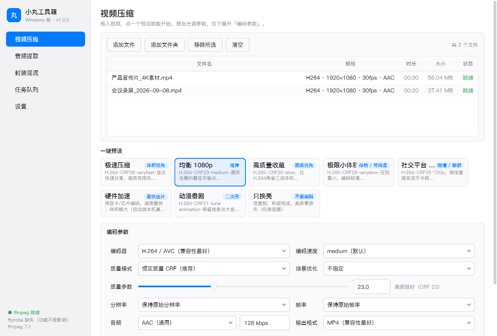
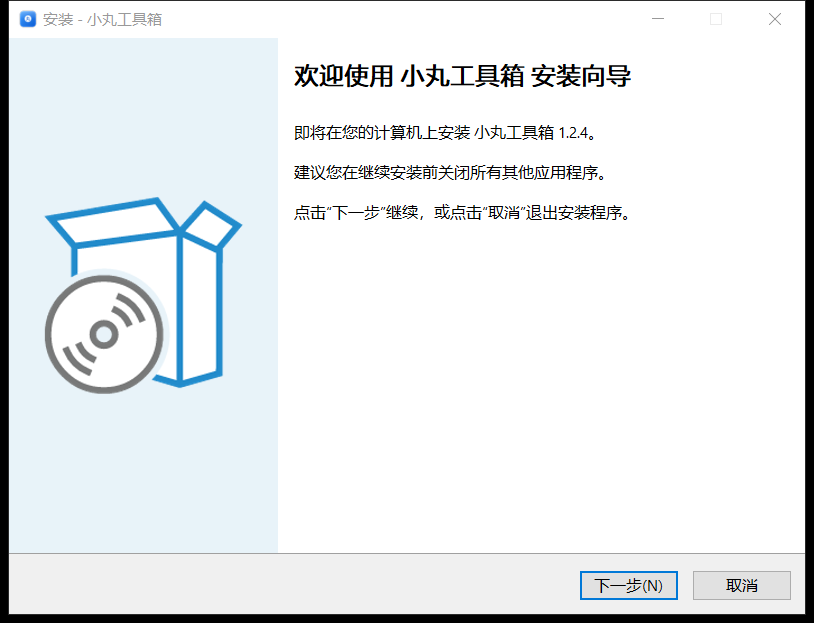
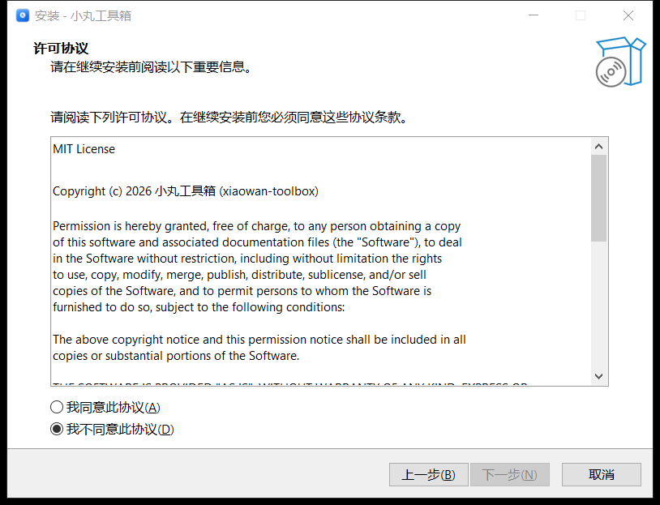
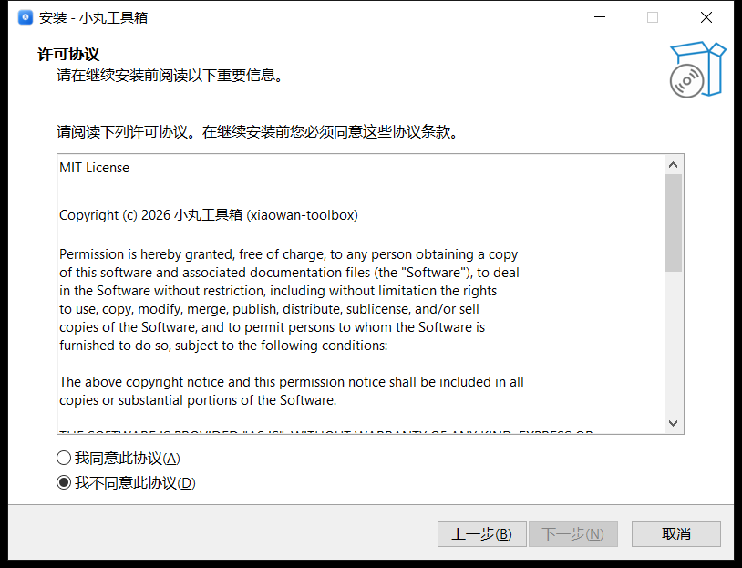

# 小丸工具箱（跨平台重制版）

Windows 上经典视频压缩工具「小丸工具箱」的重制版，**macOS / Windows 共用一套代码**。
基于 **PySide6 (Qt 6) + FFmpeg**，原生桌面风格，支持浅色 / 深色主题。



## 下载安装

| 平台 | 怎么装 |
| --- | --- |
| **Windows** | 下载 [`XiaoWanToolbox-1.2.4-Setup.exe`](https://github.com/52ting/xiaowan-toolbox/releases/latest)（约 47 MB）双击安装。默认装到当前用户目录、**不需要管理员权限**，自动建开始菜单与桌面快捷方式，控制面板里能正常卸载。自带 ffmpeg，装完直接能用 |
| **macOS** | 官方不提供现成 `.app`，需要在本机跑一次构建（约 2–5 分钟），见下方 [macOS 章节](#macos)。产出的 `.app` 自带 ffmpeg，可随意拷给别人 |

全部版本与下载：<https://github.com/52ting/xiaowan-toolbox/releases>

> 发布包用英文名（`XiaoWanToolbox-…`）是必须的：GitHub Release 会剥掉资产名里的
> 非 ASCII 字符，中文名会被削成 `-1.2.4-.exe`。程序本身的界面、窗口标题全是中文。

## 功能

| 模块 | 说明 |
| --- | --- |
| **视频压缩** | H.264 / H.265 软编 + 硬件加速（Mac: VideoToolbox，Win: NVENC / QSV / AMF）；CRF 恒定质量、指定码率、指定目标体积（自动二次编码）；一键预设 8 套；分辨率 / 帧率 / 音轨裁剪；输出体积实时预估 |
| **音频提取** | MP3 / AAC(M4A) / FLAC / WAV / Opus，支持原样复制音轨、采样率与声道转换 |
| **声道下混** | 5.1 / 7.1 多声道 → 立体声 / 单声道，画面原样复制不重编码；5 套一键方案（标准 / 对白清晰 / 环绕氛围 / 夜间小声 / 单声道）；中置、环绕、低音炮三路增益独立可调；EBU R128 响度标准化、对白动态压缩、防削波限幅；**输出体积实时预估**（不再被「成品怎么这么小」吓到） |
| **多轨合并下混** | 拆成多个单声道的素材（如 5.1 的 前左/前右/中置/低音炮/后左/后右 六个文件）合成一条多声道再下混，**只产出一个文件**；文件表直接标出每路声道槽位，文件名里的 FL / 前左 / Ls / Rs 等标记可一键自动排序；顺序与槽位不符时开始前弹窗提醒并可一键纠正；各路时长不齐时自动补齐，不会被最短那路截断 |
| **封装混流** | MP4 / MKV / MOV 换壳（不重编码，秒级完成）；挑音轨、嵌入同名字幕（.srt/.ass/.vtt）、faststart |
| **任务队列** | 批量拖拽、实时进度 / 速度 / 剩余时间、并发数可调、取消与重试、失败原因用人话提示 |
| **设置** | ffmpeg 路径自动检测（内置 / PATH / 系统常见位置 / 手动指定）、输出目录与命名规则、主题 |

---

## Windows

### 方式一：安装程序（推荐）

下载 `XiaoWanToolbox-1.2.4-Setup.exe` 双击，按向导走完即可。
不写注册表脏数据、不装服务，卸载就是删目录 + 删快捷方式。

安装程序长这样（Inno Setup 打包）：

| 欢迎 | 许可协议 | 选择目录 |
| --- | --- | --- |
|  |  |  |

> 默认装到 `%LOCALAPPDATA%\Programs\小丸工具箱`，全程无需管理员权限。
> 想装给所有用户就在命令行加 `/ALLUSERS`。

### 方式二：免安装（便携）

双击 `dist/小丸工具箱/小丸工具箱.exe`。
**自带 ffmpeg，不需要装任何东西**；整个文件夹拷给别人也能直接用。

### 从源码运行

```bat
python -m venv .venv
.venv\Scripts\pip install -r requirements.txt
.venv\Scripts\python run.py
```

### 打包成 exe

```bat
pip install pyinstaller pillow
python packaging\build_windows.py --clean
```

脚本会：检查 / 准备 `bin\ffmpeg.exe` → 生成 `icon.ico` → PyInstaller 打包
→ 输出到 `dist\小丸工具箱\`。

> `bin\ffmpeg.exe` 不入库（太大），获取方式见 [`bin/README.md`](bin/README.md)。
> 没有它也能打包，只是产物不自带 ffmpeg。

### 打成安装程序

```bat
ISCC.exe packaging\xiaowan_setup.iss
```

产物：`installer_out\XiaoWanToolbox-1.2.4-Setup.exe`。
需要 [Inno Setup 6](https://jrsoftware.org/isdl.php)（用 winget 装也行：
`winget install -e --id JRSoftware.InnoSetup`）。
脚本会读取 `packaging\ChineseSimplified.isl`，中文界面对外可用，无需额外装语言包。

---

## macOS

macOS 上没有现成的 `.app` 可以直接下载，需要**在本机跑一次构建**（约 2–5 分钟）。
构建产物 `小丸工具箱.app` 自带 ffmpeg，之后可以随意拷贝到别的 Mac 上用。

### 0. 前置条件（只做一次）

```bash
# 命令行工具（提供 python3 / git 等，若已装过会提示 already installed）
xcode-select --install

# Homebrew（没有的话）
/bin/bash -c "$(curl -fsSL https://raw.githubusercontent.com/Homebrew/install/HEAD/install.sh)"

# ffmpeg —— 构建时会被复制进 .app，所以这台机器上必须有
brew install ffmpeg
```

> Intel 芯片路径是 `/usr/local/bin`，Apple Silicon（M 系列）是 `/opt/homebrew/bin`，
> 程序两者都会自动找，不用手动配 PATH。

### 1. 解压源码包

双击 `小丸工具箱-Mac源码包.zip` 解压，然后在**终端**里进入这个目录：

```bash
cd ~/Downloads/xiaowan-mac        # 换成你实际解压的位置
```

### 2. 方式一：直接跑源码（最快，适合先试一下）

```bash
python3 -m venv .venv
.venv/bin/pip install -r requirements.txt
.venv/bin/python run.py
```

窗口会直接弹出来。以后每次启动就最后一行那条命令。
想更省事可以做个快捷方式：

```bash
echo ".venv/bin/python run.py" > 启动.command && chmod +x 启动.command
```
以后双击目录里的 `启动.command` 就能开。

### 3. 方式二：打成独立 .app（推荐，可拷贝分享）

```bash
bash packaging/build_macos.sh          # 生成 dist/小丸工具箱.app
bash packaging/build_macos.sh --dmg    # 顺便生成 dist/小丸工具箱.dmg
```

脚本会自动：建 `.buildenv` 虚拟环境 → 装依赖 → 把 Homebrew 的 ffmpeg / ffprobe
复制进 `bin/` → 用 `sips`+`iconutil` 生成应用图标 → PyInstaller 打包 → 本地临时签名。

完成后把 `dist/小丸工具箱.app` 拖进「应用程序」文件夹即可。
**这个 .app 里已经带了 ffmpeg，拷到没装过 Homebrew 的 Mac 上也能直接跑。**

构建常见卡点：

| 现象 | 原因 / 处理 |
| --- | --- |
| `未找到 ffmpeg` 并退出 | 忘了 `brew install ffmpeg`；或想跳过内置：`bash packaging/build_macos.sh --no-ffmpeg`（那台机器要自己装 ffmpeg） |
| `command not found: python3` | 先跑 `xcode-select --install` |
| 卡在 `pip install` | 网络问题，可换源：`export PIP_INDEX_URL=https://pypi.tuna.tsinghua.edu.cn/simple` |
| `sips` / `iconutil` 报错 | 这两个是 macOS 自带工具，报错一般是上一步的 `icon.png` 没生成，重跑一次即可（图标本来也不是必需） |

### 4. 首次打开被 Gatekeeper 拦下怎么办

因为没做苹果开发者公证，第一次双击（尤其是从别的 Mac 拷过来的）可能出现
「无法打开，因为 Apple 无法检查其是否包含恶意软件」。任选一种放行：

```bash
xattr -cr "/Applications/小丸工具箱.app"     # 推荐：清掉隔离标记
```

或：**在 Finder 里右键点图标 → 打开 → 再点「打开」**；
或：系统设置 → 隐私与安全性 → 拉到底 → 点「仍要打开」。

> 如果 .app 是从压缩包/网络传过来的，`xattr -cr` 基本上是必做的一步；
> 偶尔还会遇到「已损坏」提示，同一条命令也能解决。

### 5. 卸载

- 源码运行：删掉解压出来的 `xiaowan-mac` 整个文件夹即可。
- .app：把「应用程序」里的 `小丸工具箱.app` 拖进废纸篓。
- 配置残留（输出目录、主题、上次的预设）在 `~/Library/Application Support/XiaoWanToolbox/`，
  想彻底清干净就一并删掉。

### 6. 用起来和 Windows 版一样吗

一样，只是两点平台差异：

- 硬件加速在 Mac 上走 **VideoToolbox**（`h264_videotoolbox` / `hevc_videotoolbox`），
  速度比软编快很多、体积略大；追求最高压缩率时手动切回 `libx264` / `libx265`。
- 输出格式里的 `MOV` 在 Mac 上更实用（QuickTime 原生支持），Windows 侧一般用 MP4。

---

## 硬件加速是怎么选的

不写死型号——**运行时按平台 + 真机试编决定**：

| 平台 | 候选（按优先级） |
| --- | --- |
| macOS | `h264_videotoolbox` / `hevc_videotoolbox` |
| Windows | `h264_nvenc`（NVIDIA） → `h264_qsv`（Intel） → `h264_amf`（AMD） |
| Linux | `h264_nvenc` |

关键点：**「ffmpeg 编译了这个编码器」不等于「本机能用」**。
`h264_qsv` / `h264_amf` 常年出现在 `ffmpeg -encoders` 列表里，但没有对应显卡或驱动时
一跑就报错。所以程序会真的试编 3 帧来确认，只有通过的才会被选中；
一个都不通过时自动回退软编（libx264 / libx265），并在编码器下拉里如实标注。

各家硬件编码器的「速度档」和「恒定质量」参数并不通用，程序会做翻译：
NVENC 用 `-preset p1~p7` + `-rc vbr -cq N`，QSV 用 `-global_quality`（不吃 `-preset`），
AMF 用 `-quality` + `-rc cqp`，VideoToolbox 用 `-prio_speed` / `-q:v`。

---

## 项目结构

```
xiaowan-mac/
├── run.py                    # 启动入口（含崩溃兜底：无控制台 exe 也能留日志/弹窗）
├── requirements.txt
├── LICENSE                   # MIT（另附 FFmpeg / Qt 第三方组件说明）
├── .gitignore                # 排除 dist/、build/、bin/*.exe 等大体积产物
├── bin/                      # 放置内置 ffmpeg / ffprobe（打包时一起打进去）
├── app/
│   ├── main.py               # QApplication 装配
│   ├── context.py            # 配置 + ffmpeg 环境 + 队列，全局共享
│   ├── core/                 # 纯逻辑层（不依赖界面）
│   │   ├── ffmpeg.py         #   二进制定位、媒体探测、编码器可用性试编
│   │   ├── presets.py        #   预设、参数选项、硬件编码器解析
│   │   ├── commands.py       #   命令构造（压缩/二压/音频/封装/声道下混）
│   │   ├── pipeline.py       #   参数 -> Task 装配
│   │   ├── engine.py         #   队列调度、进度解析、取消、并发
│   │   ├── task.py           #   任务模型
│   │   ├── config.py         #   配置持久化
│   │   └── utils.py          #   平台判断与格式化
│   └── ui/
│       ├── main_window.py    # 侧边栏 + 页面栈
│       ├── style.py          # 浅色/深色两套 QSS
│       ├── widgets.py        # 拖拽文件表、进度绘制、卡片
│       └── pages/            # 压缩 / 音频 / 下混 / 封装 / 队列 / 设置
├── tests/
│   ├── smoke_test.py         # 端到端：链路 + 探测 + 边界（36 项断言）
│   ├── downmix_test.py       # 声道下混：布局/矩阵/命令/合并/体积预估（98 项断言）
│   ├── downmix_e2e_test.py   # 声道下混：真跑 ffmpeg 验证混音结果（53 项断言）
│   ├── merge_ui_test.py      # 多轨合并界面：前缀/排序/只产出一个任务（45 项断言）
│   ├── engine_test.py        # 引擎：批量/进度/取消/并发（11 项断言）
│   ├── verify_exe.py         # 打包产物冒烟：启动 exe 并截图确认界面渲染
│   └── screenshot.py         # 逐页自动截图
└── packaging/
    ├── xiaowan.spec          # macOS PyInstaller 配置
    ├── xiaowan_win.spec      # Windows PyInstaller 配置
    ├── xiaowan_setup.iss     # Windows 安装程序脚本（Inno Setup 6）
    ├── ChineseSimplified.isl # 安装程序简体中文语言包（随仓库走，免装）
    ├── build_windows.py      # Windows 一键构建
    ├── build_macos.sh        # macOS 一键构建
    ├── make_ico.py           # .ico 生成（Windows）
    └── make_icon.py          # .png 生成（通用）
```

## 5.1 转立体声是怎么混的

不用 `-ac 2` 让 ffmpeg 自作主张，而是用 `pan` 滤镜手写混音矩阵：

- 中置（人声）、环绕（声场）、低音炮（LFE）三路增益独立可调，标准方案遵循
  ITU-R BS.775：中置 / 环绕各 -3dB（0.707 倍）；
- 声道布局**按 `channel_layout` 精确判断**，而不是只看声道数——
  5.0 和 5.1 只差一个声道，但 5.0 的索引 3 是左后环绕而非低音炮，
  搞混会把整路环绕声当成低音炮丢掉（实测用逐声道频率探针验证过）；
- 多路叠加后峰值可能超过 0dB 造成硬削波（不可逆失真），默认在链尾加
  `alimiter` 收在 -0.45dB，代价约 5ms 延迟（实测无感知）；
- 响度标准化用 EBU R128（`loudnorm`），它内部固定跑 192kHz，
  必须显式 `aresample` 拉回源采样率，否则输出文件会莫名巨大。

## 设计上的几个取舍

- **ffmpeg 多级回退**：应用内置 → 环境变量 → PATH → 系统常见路径 → imageio-ffmpeg 兜底。
  没有 ffprobe 时自动降级用 `ffmpeg -i` 解析媒体信息，功能不受影响。
- **取消必须真的停**：用 `terminate()` 杀进程，并处理了「取消请求落在进程尚未
  创建完成的窗口期」这一竞态（进程创建完成后会再补查一次取消标记）。
- **半成品清理**：任务取消或失败时自动删除输出到一半的文件。
- **不覆盖已有文件**：默认自动追加 `_1`、`_2` 序号，可在设置里改为覆盖。
- **打包产物不留白屏**：无控制台的 exe 崩溃时会默认静默退出，所以入口加了
  兜底——异常写进 `%APPDATA%\XiaoWanToolbox\crash.log` 并弹原生错误框。

## 测试

```bash
python tests/smoke_test.py        # 不开窗口，36 项断言
python tests/downmix_test.py      # 声道下混静态验证，98 项断言
python tests/downmix_e2e_test.py  # 声道下混真跑 ffmpeg，53 项断言
python tests/merge_ui_test.py 输出目录  # 多轨合并界面，45 项断言（顺带截图）
python tests/engine_test.py       # 队列引擎，11 项断言
python tests/screenshot.py 输出目录      # 逐页截图
python tests/verify_exe.py     # 启动打包好的 exe 并截图验证
```

## 许可说明

本程序自身代码以 **MIT** 发布，见 [`LICENSE`](LICENSE)。

调用到的第三方组件另有其授权，对外分发时请一并遵守：

- **FFmpeg** —— LGPL 2.1+ 或 GPL 2+/3+（取决于具体构建）。本仓库不分发 ffmpeg 二进制；
  打包时若放入了 `bin\ffmpeg.exe`，请自行确认所用构建的许可并满足其义务
  （GPL 构建需提供源码获取方式）。见 <https://ffmpeg.org/legal.html>。
- **Qt for Python (PySide6)** —— LGPL v3。
